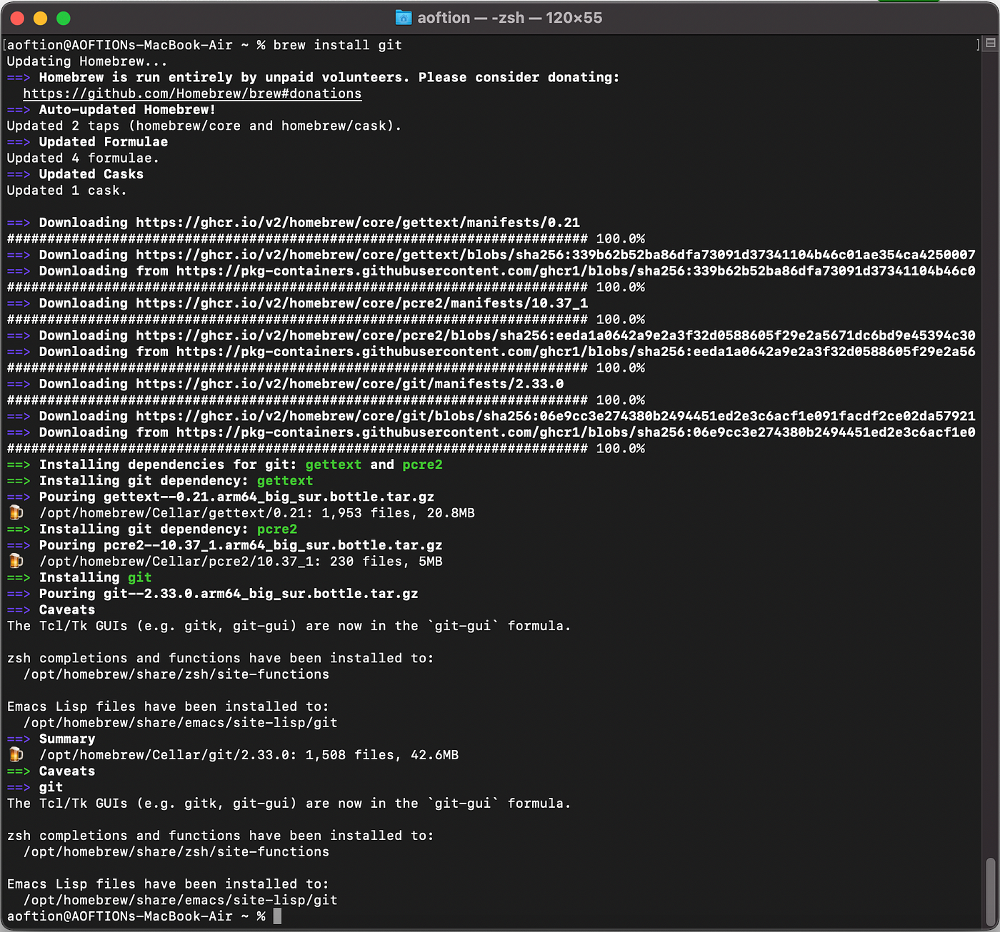

# Install Git
The main reason is to use GitHub. (jk)

Everyone calls it "Version Control System"

FYI: This YouTube video is so far the best for me that explains about Git very well  [https://youtu.be/8JJ101D3knE]

So, first of all, if you have or someone have installed Git on your Lappy or sth, you need to check by typing this in Terminal 

```
git --version
```
if it shows `git version blah blah blah` then, it is already installed.

if it doesn't we need to install it, ***Remember, we should do it on Terminal 'cause it is NICE***

Since, we have the Brew -- we will be using the following command line 

```
brew install git
```
And boom it will be showing like this


